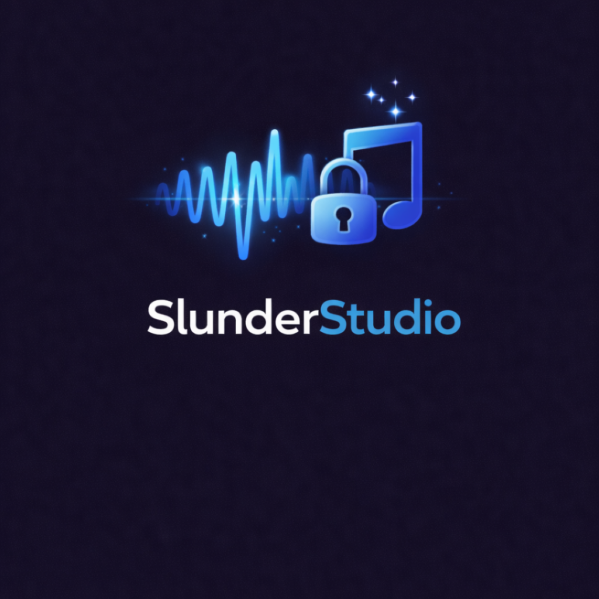

<!-- codex-branding:start -->
<p align="center"></p>

<p align="center">
  
  
  
</p>
<!-- codex-branding:end -->

# Slunder Studio


> Offline AI music generation suite. Generate songs, compose MIDI, synthesize vocals, separate stems, create SFX, and master tracks — all locally on your machine.


## Quick Start

```bash
git clone https://github.com/SysAdminDoc/SlunderStudio.git
cd SlunderStudio
python main.py  # Auto-installs dependencies on first run
```

Python 3.10+ required. Core dependencies install automatically. AI models are downloaded on-demand from HuggingFace via the built-in Model Hub.

## Features

| Module | Description | AI Engine |
|--------|-------------|-----------|
| Song Forge | Full song generation from lyrics + style tags | ACE-Step |
| Lyrics Engine | AI-powered lyrics writing with 33 genre templates | Llama 3.2 1B |
| MIDI Studio | Piano roll editor + text-to-MIDI composition | MIDI-LLM |
| Vocal Suite | Singing synthesis, voice conversion, voice cloning | DiffSinger, RVC v2, GPT-SoVITS |
| Stem Separation | Isolate vocals, drums, bass, and other instruments | Demucs (htdemucs) |
| SFX Generator | Text-to-sound-effect generation | Stable Audio Open |
| Mixer | Multi-track mixing with smart mastering (8 presets) | Built-in DSP |
| AI Producer | One prompt to full song — auto-chains all modules | Orchestrator |
| Model Hub | Download, manage, and switch AI models | HuggingFace Hub |
| Projects | Save/load projects with version history and asset tracking | — |

## How It Works

```
┌──────────────┐    ┌──────────────┐    ┌──────────────┐    ┌──────────────┐
│  AI Producer │───>│ Lyrics Engine│───>│  Song Forge  │───>│  MIDI Studio │
│  (One Prompt)│    │  (33 genres) │    │  (ACE-Step)  │    │  (Piano Roll)│
└──────────────┘    └──────────────┘    └──────────────┘    └──────┬───────┘
                                                                   │
┌──────────────┐    ┌──────────────┐    ┌──────────────┐    ┌──────▼───────┐
│   Export     │<───│    Mixer     │<───│ SFX Generator│    │ Vocal Suite  │
│  (WAV/FLAC) │    │ (Mastering)  │    │(Stable Audio)│    │(DiffSinger)  │
└──────────────┘    └──────────────┘    └──────────────┘    └──────────────┘
```

Every module can route audio to any other module. Generate a song in Song Forge, separate stems in Vocal Suite, add SFX, mix everything in the Mixer, and export a mastered track.

## Mastering Presets

| Preset | Target LUFS | Character |
|--------|-------------|-----------|
| Balanced | -14.0 | Neutral, general purpose |
| Loud / Radio | -11.0 | Compressed, bright, competitive loudness |
| Warm / Analog | -14.0 | Enhanced lows, rolled-off highs, narrow stereo |
| Bright / Crisp | -14.0 | Enhanced highs, mid presence, wide stereo |
| Hip-Hop / Trap | -12.0 | Heavy sub-bass, punchy compression |
| Cinematic | -16.0 | Dynamic range, wide stereo, gentle compression |
| Lo-Fi | -16.0 | Rolled-off highs, heavy compression, narrow |
| Streaming (Spotify) | -14.0 | Optimized for streaming platform normalization |

## AI Models

Models are downloaded on-demand through the Model Hub. Nothing downloads until you need it.

| Model | Size | Module | Required |
|-------|------|--------|----------|
| ACE-Step | ~3 GB | Song Forge | Recommended |
| Llama 3.2 1B | ~2 GB | Lyrics Engine | Recommended |
| DiffSinger (ONNX) | ~500 MB | Vocal Suite | Optional |
| RVC v2 | ~200 MB/voice | Vocal Suite | Optional |
| Demucs (htdemucs) | ~300 MB | Stem Separation | Optional |
| Stable Audio Open | ~3 GB | SFX Generator | Optional |

All models run entirely on your local machine. No cloud APIs, no subscriptions, no data leaves your computer.

## System Requirements

| Component | Minimum | Recommended |
|-----------|---------|-------------|
| OS | Windows 10 / Linux / macOS | Windows 11 / Ubuntu 22.04+ |
| Python | 3.10 | 3.11+ |
| RAM | 8 GB | 16 GB+ |
| GPU | None (CPU mode) | NVIDIA 8GB+ VRAM (CUDA) |
| Disk | 2 GB (app only) | 20 GB+ (with models) |

GPU acceleration requires PyTorch with CUDA support. The app runs on CPU without any GPU, but generation will be slower.

## Configuration

Settings are stored in `~/.config/SlunderStudio/` (Linux/macOS) or `%APPDATA%/SlunderStudio/` (Windows).

```
SlunderStudio/
├── settings.json          # App preferences
├── voice_bank.json        # Voice model profiles
├── projects/              # Saved projects with version history
├── models/                # Downloaded AI models
├── voices/                # Voice model files
└── generations/           # All generated outputs
    ├── songs/             # Song Forge output
    ├── lyrics/            # Lyrics Engine output
    ├── midi_studio/       # MIDI generation output
    ├── midi_renders/      # FluidSynth renders
    ├── vocals/            # DiffSinger output
    ├── voice_convert/     # RVC output
    ├── voice_clone/       # GPT-SoVITS output
    ├── stems/             # Demucs separation output
    ├── sfx/               # SFX Generator output
    └── ai_producer/       # AI Producer pipeline output
```

## Building

Create a standalone executable with PyInstaller:

```bash
pip install pyinstaller
python build/build.py           # One-folder distribution
python build/build.py --onefile # Single .exe (Windows)
```

Output lands in `dist/SlunderStudio/`.

## Project Structure

```
SlunderStudio/
├── main.py                     # Entry point with auto-bootstrap
├── core/                       # Core infrastructure
│   ├── audio_engine.py         # Playback engine (sounddevice)
│   ├── audio_export.py         # WAV/FLAC/MP3 export
│   ├── lyrics_db.py            # Lyrics database with search
│   ├── mastering.py            # DSP mastering chain
│   ├── midi_utils.py           # MIDI I/O (pretty_midi wrapper)
│   ├── model_manager.py        # HuggingFace model downloads
│   ├── project.py              # Project save/load/versioning
│   ├── settings.py             # Persistent settings
│   ├── voice_bank.py           # Voice profile management
│   └── workers.py              # Background inference workers
├── engines/                    # AI engine wrappers
│   ├── ace_step_engine.py      # ACE-Step song generation
│   ├── ai_producer.py          # One-prompt pipeline orchestrator
│   ├── audio_analyzer.py       # BPM/key/loudness analysis
│   ├── demucs_engine.py        # Stem separation
│   ├── diffsinger_engine.py    # Singing voice synthesis
│   ├── fluidsynth_engine.py    # MIDI-to-audio rendering
│   ├── lyrics_engine.py        # LLM lyrics generation
│   ├── lyrics_templates.py     # 33 genre template definitions
│   ├── midi_llm_engine.py      # Text-to-MIDI generation
│   ├── rvc_engine.py           # RVC + GPT-SoVITS voice engines
│   ├── sfx_engine.py           # Stable Audio Open SFX
│   └── style_tags.py           # ACE-Step style tag database
├── ui/                         # PySide6 interface
│   ├── main_window.py          # Main window with sidebar navigation
│   ├── theme.py                # Catppuccin Mocha dark theme
│   ├── onboarding.py           # First-run wizard
│   ├── song_forge_view.py      # Song generation page
│   ├── lyrics_view.py          # Lyrics writing page
│   ├── lyrics_editor.py        # Rich lyrics editor
│   ├── midi_studio_view.py     # MIDI composition page
│   ├── piano_roll.py           # QGraphicsView piano roll
│   ├── midi_mixer.py           # MIDI track mixer
│   ├── vocal_suite_view.py     # Vocal synthesis page
│   ├── stem_mixer.py           # Demucs stem mixer
│   ├── sfx_view.py             # SFX generation page
│   ├── mixer_view.py           # Multi-track mixer + mastering
│   ├── ai_producer_view.py     # AI Producer page
│   ├── project_manager.py      # Project browser
│   ├── model_hub.py            # Model download manager
│   ├── settings_view.py        # Settings page
│   ├── waveform_widget.py      # Audio waveform display
│   ├── mood_curve_editor.py    # Mood/energy curve editor
│   ├── reference_panel.py      # Reference audio panel
│   ├── seed_explorer.py        # Seed variation explorer
│   ├── batch_view.py           # Batch generation
│   └── toast.py                # Toast notifications
├── assets/templates/           # 33 genre JSON templates
├── build/build.py              # PyInstaller packaging
├── requirements.txt            # Dependencies
└── LICENSE                     # MIT License
```

## FAQ

**Q: Do I need a GPU?**
No. Everything runs on CPU. A CUDA-capable NVIDIA GPU (8GB+ VRAM) dramatically speeds up AI generation but is not required.

**Q: How much disk space do models need?**
About 3 GB for the recommended models (ACE-Step + Llama). The full model suite is approximately 10 GB. Models download on-demand — nothing installs until you request it.

**Q: Can I use my own voice models?**
Yes. Import RVC `.pth` models or GPT-SoVITS checkpoints through the Voice Bank. The app auto-detects models in standard directories.

**Q: Is any data sent to the cloud?**
No. All processing is local. The only network traffic is model downloads from HuggingFace, which you initiate manually.

## License

MIT License. See [LICENSE](LICENSE) for details.

---

Built by [SysAdminDoc](https://github.com/SysAdminDoc) with Slunder.
